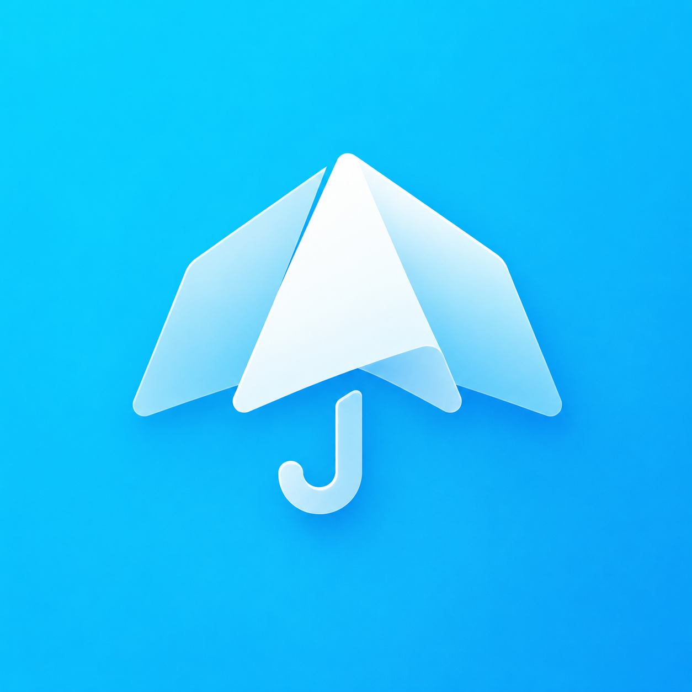
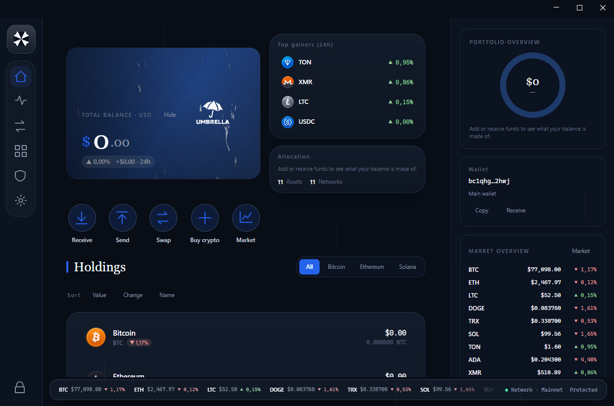

<div align="center">


# ☂️ Umbrella Wallet

<sub>a **the fear** app ·  [t.me/UmbrellaWallet](https://t.me/UmbrellaWallet)</sub>

### Your money. Your keys. Nobody watching. 🌧️

**The crypto wallet that never asks who you are.**
No account. No email. No phone number. No KYC. Just a wallet — the way it was meant to be.

<br/>


<br/>


-5AC8B4)


<br/>

**[⬇️ Download latest (v4.3.0)](https://github.com/kiurakku/umbrella-wallet/releases/latest)** · [💖 Sponsor](https://github.com/sponsors/kiurakku) · [📣 Telegram](https://t.me/UmbrellaWallet) · [All releases](https://github.com/kiurakku/umbrella-wallet/releases)

<br/>



<sub>© 2026 Umbrella Wallet</sub>

</div>

---

## 🌂 Why Umbrella?

Every mainstream wallet and exchange wants your passport, your face, your phone — and then keeps your coins on **their** servers. When they freeze, get hacked, or simply decide you're "suspicious", your money stops being yours. 🧊

Umbrella flips that model:

- 🕵️ **Truly anonymous.** Install and go. There is no registration screen, because there is nothing to register. Nothing in the app identifies you.
- 🔑 **You hold the keys.** Your 24-word recovery phrase is created on *your* computer and never leaves it. Not to us, not to anyone. We literally *cannot* touch your funds — that's the point.
- 🧅 **Tor built in — with a kill-switch.** Flip one switch and the wallet's traffic goes through the Tor network — no separate install, no configuration. Turn on **Tor-only** and it **fails closed**: if Tor is off, still connecting or drops, the wallet *refuses* to touch the clearnet instead of leaking your IP. Your IP stays out of your finances, guaranteed.
- 🥷 **Secrets that can't be screenshotted.** While your recovery phrase is on screen, the window renders black to screen-capture and remote-viewing software.
- 💸 **Real money movement.** Send and receive Bitcoin, Ethereum, Litecoin, Solana, **TON**, TRON, USDT and Monero — to any wallet or exchange in the world. Transactions are signed on your machine; only the signed result ever goes out. TON transfers are pinned byte-for-byte against the reference `@ton` library, so a wrong byte can never strand funds.
- ₿ **A real Bitcoin/Litecoin HD wallet.** Balance, history and spending work across *every* address you've ever used — plus fresh receive addresses on request, with change returned privately to an internal address. What the wallet shows you is exactly what it can find and spend.
- ✅ **Backups you can trust.** Verify a backup actually decrypts and holds a valid phrase *before* you rely on it — without exposing the seed. Every release ships a checksum file the build itself verifies.
- 📈 **Live market, real candles.** A built-in market with **real OHLC candlestick charts** (Binance klines) and live prices (CoinGecko) — timeframes from 1H to 1Y. No mock data anywhere.
- 🎨 **Yours to look at.** 27 colour themes, six interface languages, movable navigation, and full **profile customization** — your own avatar, banner and sidebar backgrounds, plus optional ambient motion (rain, drifting aurora, animated stickers — each toggled on its own). A private wallet doesn't have to feel like a tax form.
- 💾 **Updates keep your data.** Installing a new version never touches your wallets, theme, linked addresses or history — they live in a separate data folder, not in the app files.

## ⚔️ Umbrella vs. the usual suspects

| | ☂️ Umbrella | 🏦 Exchange app | 👛 Typical wallet |
|---|:---:|:---:|:---:|
| Sign-up / KYC | ❌ none | 🪪 passport + selfie | 📧 often email |
| Who holds the keys | 🫵 you | 🏢 them | 🫵 you |
| Can freeze your funds | ❌ impossible | ✅ any time | ❌ |
| Tor anonymity | ✅ one switch + kill-switch | ❌ | ⚠️ manual setup |
| Monero support | ✅ full wallet | ⚠️ delisting it | ❌ rare |
| Screenshot-proof seed | ✅ | — | ❌ |
| Tracks you | ❌ zero analytics | ✅ extensively | ⚠️ usually |
| Price | 🆓 | "free" (you're the product) | 🆓 |

## 💼 What you can do

| | |
|---|---|
| 📥 **Receive** | One tap shows a QR + address for any coin. Colour-coded so you never receive on the wrong network. |
| 📤 **Send** | To any address or exchange deposit. Clear review step, economical fees by default. |
| 👁️ **Watch** | Track any public address (your Ledger, an old MetaMask) without ever importing a key. |
| 🏦 **Link exchanges** | See your Binance, Bybit, OKX, Kraken, KuCoin, Gate.io, MEXC, Bitget and Telegram CryptoBot balances beside your on-chain coins — via **read-only** keys that can't move funds. |
| 📊 **Follow the market** | Real candles, five time windows (1H → 1Y), auto-refresh — for every listed coin. |
| 💾 **Back up** | One click exports an encrypted backup file. Useless to a thief, priceless to future-you. |
| 🔐 **Lock** | Auto-locks after idle. `Ctrl+L` locks instantly. |

<div align="center">

<br/><sub>📈 Live market · exchange-style charts · 1H to 1Y</sub>
</div>

## 🪙 Coins

| Coin | Receive | Send | Notes |
|------|:-------:|:----:|-------|
| 🟠 Bitcoin (BTC) | ✅ | ✅ | native SegWit |
| 🔷 Ethereum (ETH) | ✅ | ✅ | ERC-20 compatible address |
| 💵 **USDT (TRC-20)** | ✅ | ✅ | Tether on TRON — fee paid in TRX |
| 🕶️ **Monero (XMR)** | ✅ | ✅ | full private wallet, powered by Monero's own engine |
| ⚪ Litecoin (LTC) | ✅ | ✅ | native SegWit |
| 🟣 Solana (SOL) | ✅ | ✅ | |
| 🔺 TRON (TRX) | ✅ | ✅ | |
| 🐕 Dogecoin (DOGE) | ✅ | ➖ | receive + balance |
| 💎 **TON** | ✅ | ✅ | wallet v4R2, signed on device · pinned to `@ton` |
| 🔵 Cardano (ADA) | ✅ | ✅ | on-device signing, Koios broadcast |

## 🎨 Make it yours

- **27 themes** — the fear noir, brand palettes (Uniswap, Binance, TON, TRON, Solana, Ethereum, Monero, Kraken…), OLED black, Nord, Dracula, gradients, and more. Switch live, no restart.
- **6 languages** — 🇬🇧 English · 🇺🇦 Українська · Русский · 🇨🇳 中文 · 🇪🇸 Español · 🇩🇪 Deutsch. New installs default to your OS language automatically.
- **23 display currencies** — USD, EUR, UAH, GBP, PLN, TRY, CAD, AUD, CHF, BRL, KRW, AED, KZT and more.
- **Movable navigation** — park the menu left, right, top or bottom.
- **Duck stickers** 🦆 — animated Telegram stickers greet you on Welcome, Receive, Send, Connect, Activity and Settings. Serious cryptography, unserious ducks.

## 📦 Download

Grab the newest build from the **[latest release](https://github.com/kiurakku/umbrella-wallet/releases/latest)** —
the files below are attached there for the current version:

| Platform | Package | Notes |
|----------|---------|-------|
| **Windows** | [UmbrellaWallet-Setup-4.3.0.exe](https://github.com/kiurakku/umbrella-wallet/releases/latest) | Installer — choose install folder |
| **Windows** | [`UmbrellaWallet-Portable-4.3.0.zip`](https://github.com/kiurakku/umbrella-wallet/releases/latest) | Portable — unzip and run `Umbrella.exe` |
| **Linux** | [`UmbrellaWallet-4.3.0-linux-x64.tar.gz`](https://github.com/kiurakku/umbrella-wallet/releases/latest) | Unpack, run `./Umbrella.Wallet.App` — no install required |
| **Android** | _planned_ | A native Android build (Avalonia) is on the roadmap |

### 🔎 Verify your download

Every release has a **`SHA256SUMS.txt`** attached (generated by the release workflow, not by hand). After
downloading, check that your file's hash matches the line for it:

```bash
# Linux / macOS — run in the folder with the download + SHA256SUMS.txt
sha256sum -c SHA256SUMS.txt --ignore-missing
```

```powershell
# Windows PowerShell — compare against the matching line in SHA256SUMS.txt
Get-FileHash .\UmbrellaWallet-Setup-4.3.0.exe -Algorithm SHA256
```

A matching hash proves the file wasn't corrupted or tampered with in transit. (Authenticode signing of
the Windows installer is planned — it needs a code-signing certificate — so until then Windows SmartScreen
may still warn on first run.)

## 🚀 Get started

1. ⬇️ **Windows** — download the portable zip, unzip, run `Umbrella.exe`.
2. 🐧 **Linux** — grab the tar.gz build, unpack, run `./Umbrella.Wallet.App`.
3. 🖊️ Create a wallet → **write the 24 words on paper** → done. You now have a bank in your pocket that answers to no one.

> 📣 **Web version paused.** The browser version is on hold for an indefinite period — development is focused entirely on the native desktop apps (Windows and Linux now, Android planned). News and contact: **[t.me/UmbrellaWallet](https://t.me/UmbrellaWallet)** (the only official channel).

> ✍️ **The 24 words ARE the wallet.** Anyone who has them has your money; if you lose them and your device, nobody in the universe can bring your coins back — including us. That is what "your keys" costs, and what it's worth.

## ❓ FAQ

<details><summary><b>💰 Is it really free?</b></summary><br/>
Yes. Download, use, send, receive — free. The license reserves the right to add a small, clearly-disclosed service fee to certain in-app transactions in the future; if that ever happens, you'll see it on the review screen before you confirm anything.
</details>

<details><summary><b>🔍 Can you see my balance or transactions?</b></summary><br/>
No. There is no server of ours holding your data. The app reads public blockchains directly (through Tor if you enable it), and your keys never leave your device. We can't see you, and we like it that way.
</details>

<details><summary><b>😱 I forgot my password / lost my phrase. Can you help?</b></summary><br/>
With the 24 words — yes, you can restore everything on any device, yourself. Without them — nobody can, and that includes us. That's not a policy, it's mathematics.
</details>

<details><summary><b>🏦 Can I move coins from Binance / another wallet here?</b></summary><br/>
Yes. Open <i>Receive</i>, pick the coin, and withdraw from the exchange to the shown address — mind the network (e.g. USDT must come over TRON/TRC-20). Or import an existing wallet's 12/24-word phrase directly.
</details>

<details><summary><b>🕶️ Why is Monero special here?</b></summary><br/>
Most wallets show XMR at best as "receive only". Umbrella ships Monero's own wallet engine inside the app, so XMR is a full coin: real balance, real private sending, keys never leaving your machine.
</details>

<details><summary><b>🧅 Do I need to install Tor?</b></summary><br/>
No — it's inside the app. One switch in <i>Settings → Privacy & Tor</i>, and the wallet's traffic goes through the Tor network on a private port that won't clash with a Tor Browser you already run.
</details>

<details><summary><b>🔓 The code is public — can I fork or modify it?</b></summary><br/>
<strong>No.</strong> Umbrella is <em>source-available</em> for transparency and security audit — you can read the code and build it for yourself — but it is <strong>not</strong> open for forks, rebrands, mirrors or derivative wallets. Forking or republishing violates the <a href="LICENSE">license</a> (Section 2). If you find a bug, open an issue; do not publish your own "Umbrella fork".
</details>

<details><summary><b>💖 Can I support the project?</b></summary><br/>
Yes — and thank you. Umbrella is independent, ad-free and funded only by its author. If it helps you, consider <a href="https://github.com/sponsors/kiurakku"><strong>sponsoring on GitHub</strong></a> or saying hi in <a href="https://t.me/UmbrellaWallet">Telegram</a>. Sponsorship keeps development going; it does not buy influence over the roadmap or your wallet.
</details>

## 🗺️ Roadmap

- 🐕 Dogecoin sending
- 📱 More platforms
- 🔔 Price alerts
- 🌐 More exchange integrations on request

## 🛠️ For builders

> **Audit, don't fork.** Source is published so you can verify what the binary does — not so you can ship a clone. Building locally for personal review is fine; publishing a fork, mirror or derivative is not. See [Source policy](#-source-policy) and [LICENSE](LICENSE).

<details>
<summary>Build from source (click to expand)</summary>

**Desktop** (.NET 8 + Avalonia):

```bash
cd desktop
dotnet run --project src/Umbrella.Wallet.App/Umbrella.Wallet.App.csproj   # run
dotnet test                                                               # 138 tests, crypto pinned to published vectors
```

Windows release: `./scripts/fetch-tor.ps1`, `./scripts/fetch-monero.ps1`, then `dotnet publish -r win-x64`.
Linux release: `./scripts/publish-linux.sh` (fetches Linux Tor/Monero helpers, packs a tar.gz).

> Umbrella is now a **desktop-only** project. The former web/backend was removed; a native **Android**
> build (Avalonia) is planned. Follow **[t.me/UmbrellaWallet](https://t.me/UmbrellaWallet)** for releases.

**Security internals:** 256-bit seed from the OS CSPRNG → BIP39 · vault encrypted with Argon2id (64 MiB) + AES-256-GCM · Monero keys go only to the local audited `monero-wallet-rpc` · Tor Expert Bundle on a private SOCKS port · backups exported still-encrypted.

</details>

## 📖 Documentation

Project documentation lives in **[`docs/`](docs/README.md)**. Umbrella is desktop-only; the earlier
web product's docs have been archived and are no longer authoritative.

| | |
|---|---|
| [Desktop app](desktop/README.md) · [Desktop architecture](docs/04-desktop.md) | what it does, network support, security model, structure |
| [Network fees](docs/07-financial.md) · [Tor](docs/TOR.md) | TRC-20 costs, send review; how Tor is bundled |
| [Roadmap](docs/CLAUDE_IMPLEMENTATION_ROADMAP_UK.md) · [Third-party binaries](THIRD_PARTY_NOTICES.md) | product direction; pinned + hash-verified Tor/Monero |
| [Archived web docs](docs/archive/legacy-web-2026-07/README.md) | historical only — the discontinued React/NestJS web product |

## ⚠️ The honest part

Umbrella is **non-custodial**. That word means: *we never hold your money, so we can never lose it, freeze it — or recover it.* You are the bank now. 🏦 Guard your phrase, check addresses before sending, start with a small test amount. Crypto transactions are final; there is no undo button anywhere in the world.

Umbrella is **free, independent, experimental self-custody software** authored by **the fear** — yours to run on your own device, at your own risk. It is provided **as-is, without any warranty**, and the author accepts **no liability** whatsoever — see [LICENSE](LICENSE). Nothing here is financial, tax or legal advice.

## 🔒 Source policy

Umbrella is **open for inspection, closed for imitation.**

| ✅ Allowed | ❌ Not allowed |
|---|---|
| Download official releases and use them | Fork, mirror or republish this repository |
| Read the source to audit security | Rebrand, rename or sell a modified build |
| Build locally to verify behaviour | Remove copyright, logos or attribution |
| Report bugs via GitHub Issues | Pull requests that add features without prior agreement |

The code is public because a **privacy wallet must be verifiable** — you should never have to trust a black box with your keys. That transparency does not grant permission to copy the project. Forks, mirrors and derivative works are **prohibited by license** and require **written permission** from the copyright holder ([LICENSE](LICENSE), Section 2).

## 💖 Sponsor

Umbrella has no ads, no tracking and no investors. If the wallet saves you time, stress or exchange fees — **sponsorship helps keep it alive.**

| | |
|---|---|
| **GitHub Sponsors** | [github.com/sponsors/kiurakku](https://github.com/sponsors/kiurakku) |
| **Community** | [t.me/UmbrellaWallet](https://t.me/UmbrellaWallet) |

Sponsors fund development and infrastructure; they do **not** get access to user data (there isn't any), priority over the roadmap, or a "premium" wallet. Your keys stay yours.

**Not affiliated with anyone.** Umbrella is not connected to, endorsed by, or partnered with any exchange, network or brand. All third-party names, logos and trademarks — Bitcoin, Ethereum, TRON, TON, Monero, Uniswap, Binance, Bybit, OKX, WhiteBit, Telegram, MetaMask, and every coin/token name — belong to their respective owners; where a name appears (a colour-theme label, a read-only exchange connector) it identifies that style or service only and implies **no affiliation or endorsement**. You are responsible for any laws or taxes that apply to you where you live.

## ℹ️ About

**Umbrella Wallet** is a privacy-first, non-custodial cryptocurrency wallet for desktop with an optional web companion.

| | |
|---|---|
| **Repository** | https://github.com/kiurakku/umbrella-wallet |
| **Releases** | https://github.com/kiurakku/umbrella-wallet/releases |
| **Sponsor** | https://github.com/sponsors/kiurakku |
| **Issues** | https://github.com/kiurakku/umbrella-wallet/issues |
| **License** | [LICENSE](LICENSE) — free to use, no derivatives, no forks |

**Topics:** `#umbrella-wallet` `#crypto-wallet` `#bitcoin` `#ethereum` `#monero` `#tor` `#privacy` `#self-custody` `#non-custodial` `#avalonia` `#dotnet` `#desktop-wallet`
## 💬 Support

Questions and bug reports are welcome as GitHub issues — best-effort support, no legal obligation.

## 📄 License

**Free to use. Not free to take.** Source is published for audit; forks and derivatives are prohibited. See [LICENSE](LICENSE) for full terms.

---


