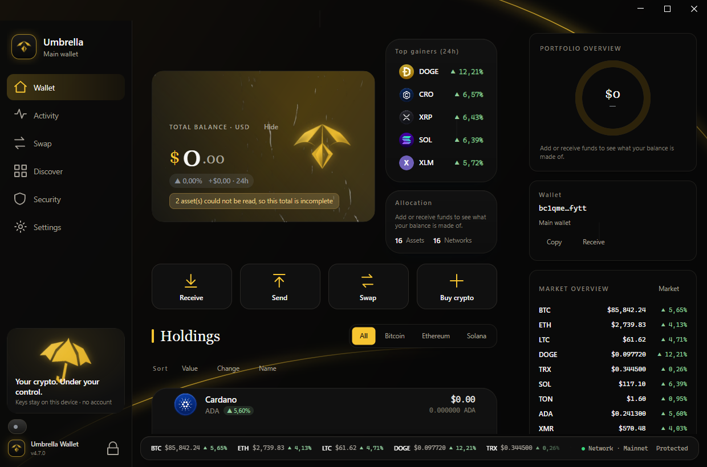
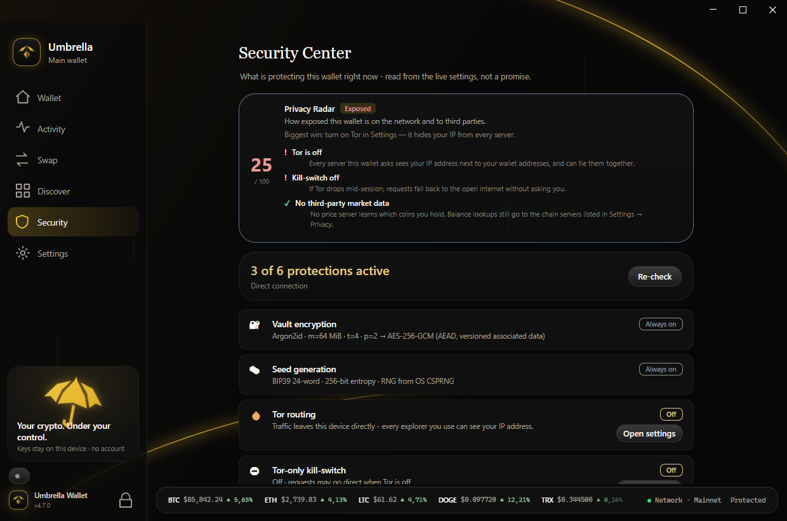
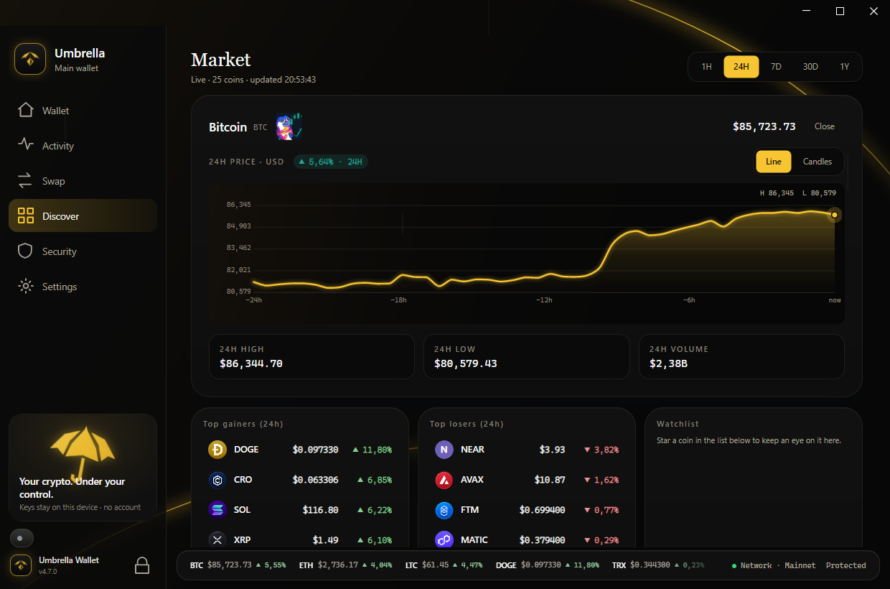
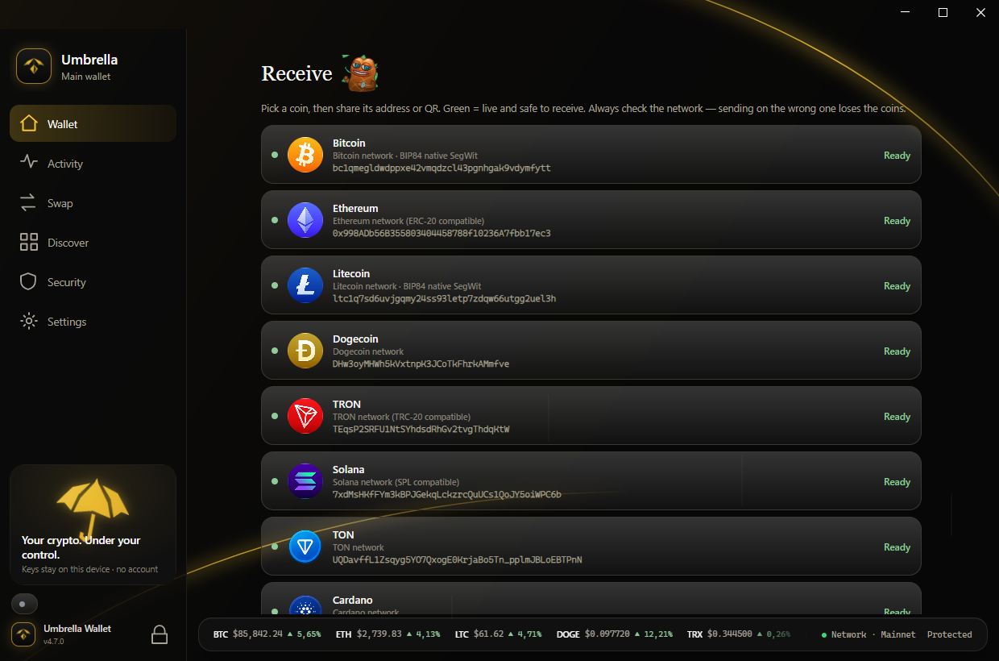
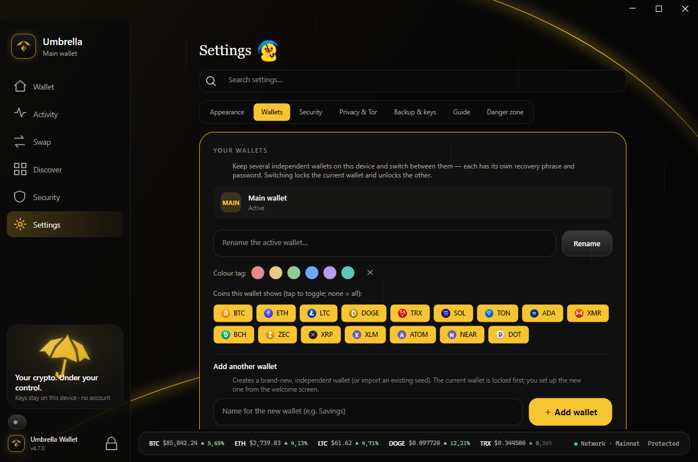
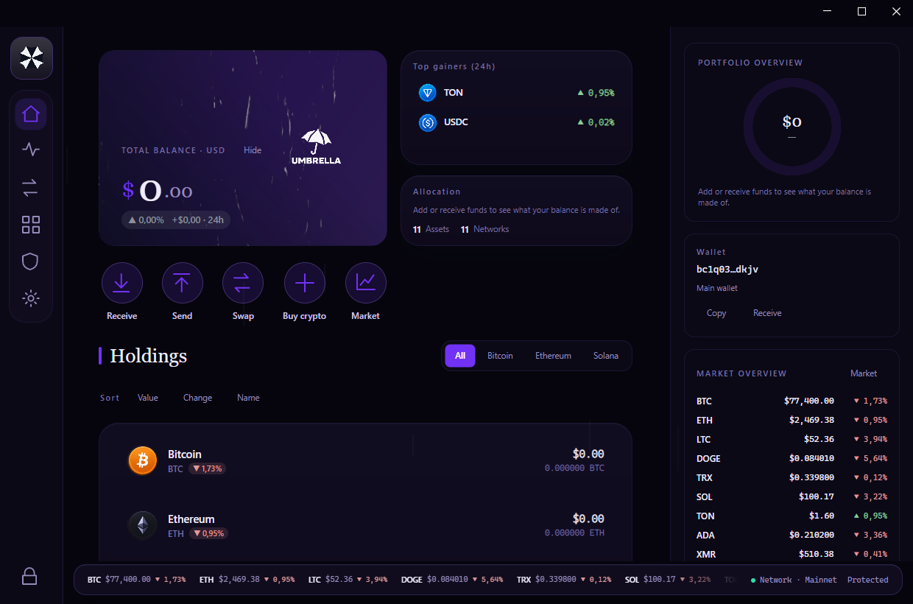
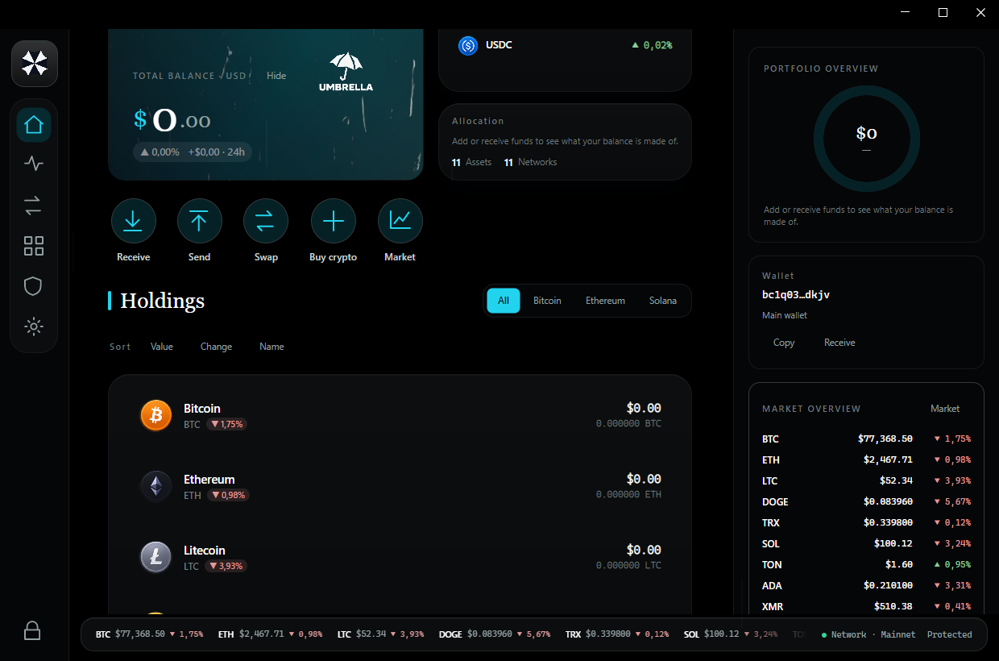
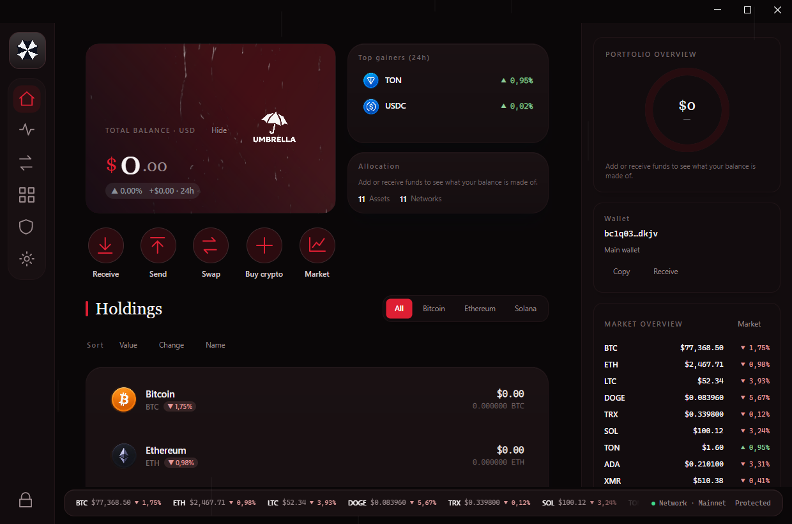
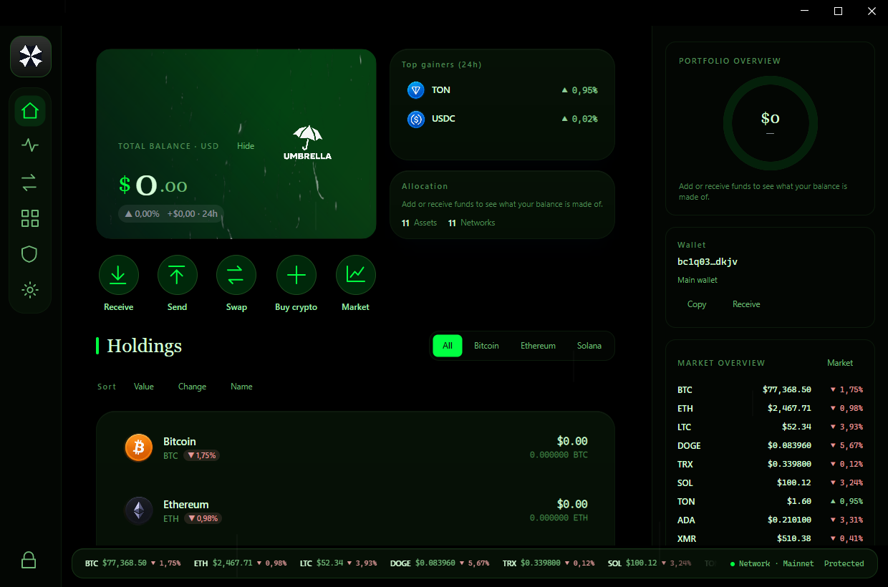
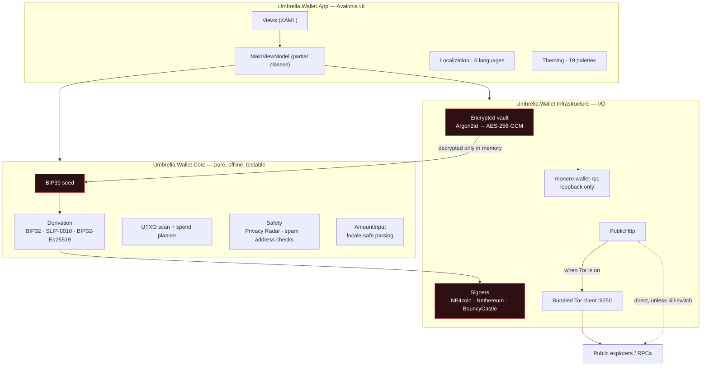

<div align="center">


# Umbrella Wallet

**A self-custody desktop crypto wallet that never asks who you are.**

No account. No email. No phone number. No KYC. No tracking. No fee on your transfers.

<sub>an independent project by <b>the fear</b></sub>

<br/>


**[⬇ Download](https://github.com/thefear078/UmbrellaWallet/releases/latest)** ·
[Verify your download](#verify-what-you-downloaded) ·
[Build it yourself](docs/building.md) ·
[Security](SECURITY.md) ·
[The rules](MANIFESTO.md) ·
[Threat model](THREAT_MODEL.md) ·
[Privacy](PRIVACY.md) ·
[**Docs index**](docs/INDEX.md)

<br/>



</div>

---

## Documentation navigation

Official docs are one web: root philosophy/legal files + `docs/` deep-dives. **Hub:** [docs/INDEX.md](docs/INDEX.md).

```
UmbrellaWallet/
├── README.md                 ← you are here
├── MANIFESTO.md              ← core philosophy (THE RULES)
├── SECURITY.md · PRIVACY.md · THREAT_MODEL.md
├── TERMS_OF_SERVICE.md · PRIVACY_POLICY.md · TRADEMARK_POLICY.md
├── LEGAL/                    ← pointers to legal docs
├── docs/
│   ├── INDEX.md              ← documentation hub
│   ├── getting-started.md
│   ├── ROADMAP.md
│   └── …
└── .github/SUPPORT.md
```

| If you want to… | Read this first |
|---|---|
| Install and use | [Getting started](docs/getting-started.md) |
| Understand the philosophy | [MANIFESTO.md](MANIFESTO.md) |
| Know security guarantees | [THREAT_MODEL.md](THREAT_MODEL.md) |
| Report a vulnerability | [SECURITY.md](SECURITY.md) |
| Build from source | [Building](docs/building.md) |
| Add a new coin | [Adding a chain](docs/adding-a-chain.md) |
| See the backlog | [ROADMAP.md](docs/ROADMAP.md) |
| Legal / store | [LEGAL/](LEGAL/README.md) · [Terms](TERMS_OF_SERVICE.md) · [Trademark](TRADEMARK_POLICY.md) |

## What this is

Umbrella is a desktop wallet for Windows and Linux that holds your keys and nothing else of yours.

Your 24-word seed is generated on your machine, encrypted into a local vault with your password
(Argon2id → AES-256-GCM), and never leaves the device. There is no server that knows you exist. There
is no account to create, nothing to verify, and no way for us — or anyone holding this software — to
freeze, seize, or recover your funds.

It holds sixteen chains in one vault — plus the Ethereum networks that share your 0x address —
including Monero as a **full** wallet rather than a receive-only stub, and ships Tor inside the binary
so your balance lookups don't hand your IP address to a block explorer. What each chain can do today,
receive, balance or send, is in [Coins](#coins) — nothing is listed as working before it does.

## Why it exists

Most wallets ask you to trade privacy for convenience, and most of them don't say so plainly.

- Exchange wallets hold your keys and know your identity.
- Most "private" wallets do one chain well. Feather is Monero. Sparrow is Bitcoin. If you hold both,
  you run both.
- Wallets with Tor support usually make you configure it. Which means most people don't.
- Nearly every wallet takes a cut of your transfers, and many bury it.

Umbrella is the wallet we wanted to exist: one vault for the coins people actually hold together,
Tor as a switch instead of a setup guide, and no cut of your money.

## What makes it different

**Monero and Bitcoin and USDT in one vault.**
Not a Monero wallet with Bitcoin bolted on, and not a Bitcoin wallet that shows XMR as "coming soon".
Monero runs the real `monero-wallet-rpc` locally over loopback, so its balance is computed on your
machine because no explorer can compute it for you.

**Tor is bundled, not assumed.**
One switch. The wallet starts its own Tor client on port 9250 — separate from a Tor Browser you may
already be running — and routes every balance lookup, price fetch and broadcast through it. There is
also a kill-switch: when it's on, a request that cannot go through Tor does not go at all.

**The Security Center tells you the truth, not a promise.**
It reads live settings and reports what is *actually* protecting the wallet right now. If Tor is off,
it says your IP is visible to every explorer you use. It will not flatter you.

<div align="center">

</div>

**You choose which server sees your addresses.**
A wallet cannot read a chain by itself — it has to ask somebody, and on a transparent chain asking
means *saying the address*. Tor hides your IP; it does not un-send an address. So Settings → Privacy
names every server the wallet talks to and what each one learns, and lets you point any chain
somewhere else — a different company, or a node you run. Monero, Bitcoin, Litecoin, Bitcoin Cash,
Dogecoin, Ethereum, Solana, TON, Tron, Cardano, XRP, Stellar, Cosmos, NEAR and Polkadot.

Two rules are enforced rather than suggested: a `.onion` node is never used without Tor and is never
silently swapped for a clearnet one, and a plain `http://` endpoint is refused outright — choosing
your own server *for privacy* and then sending addresses in clear would be worse than not choosing.

**Privacy Radar.**
Before you send, the wallet reads the transaction you are about to make and tells you what it would
reveal on-chain — chiefly whether it links coins that were previously unconnected, which is how chain
analysis de-anonymises people. The analysis runs offline, on your own data, for you.

**No cut of your transfers.**
You pay the network's miner/validator fee and nothing else. See [What this costs](#what-this-costs).

## Screenshots

| Market | Receive |
|---|---|
|  |  |
| **Settings** | |
|  | |

The default look is gold light on black: charts drawn as lines of light, and every Umbrella logo in the
app tinted to the theme you pick — only the desktop icon keeps its own colours. **20 themes**, each with
its own character rather than one accent swapped around (the original navy is still there):

| Kraken · abyssal violet | Void · electric OLED |
|---|---|
|  |  |
| **Ember · crimson editorial** | **Matrix · phosphor terminal** |
|  |  |

## Coins

Every row in the wallet prints the network under the coin name, because sending on the wrong network
is the most common way people lose money.

| Coin | Receive | Balance | Send | History | Swap | Notes |
|---|:---:|:---:|:---:|:---:|:---:|---|
| Bitcoin (BTC) | ✅ | ✅ | ✅ | ✅ | ✅ | BIP84 native SegWit, full HD scan |
| Ethereum (ETH) | ✅ | ✅ | ✅ | ✅ | ✅ | + every ERC-20 at the same address — **and now sendable**, fee in ETH |
| Litecoin (LTC) | ✅ | ✅ | ✅ | ✅ | ✅ | BIP84, full HD scan |
| Dogecoin (DOGE) | ✅ | ✅ | ✅ | ✅ | ✅ | real UTXO spend |
| Bitcoin Cash (BCH) | ✅ | ✅ | ✅ | ✅ | — | CashAddr, SIGHASH_FORKID |
| Monero (XMR) | ✅ | ✅ | ✅ | ✅ | — | local `monero-wallet-rpc`, loopback only |
| Solana (SOL) | ✅ | ✅ | ✅ | ✅ | — | SPL tokens send too (original token program; Token-2022 receive-only) |
| TRON (TRX) | ✅ | ✅ | ✅ | ✅ | — | + every TRC-20 at the same address |
| USDT (TRC-20) | ✅ | ✅ | ✅ | ✅ | — | same address as TRX; fee paid in TRX |
| TON | ✅ | ✅ | ✅ | ✅ | — | wallet v4R2, pinned to `@ton/ton` |
| Cardano (ADA) | ✅ | ✅ | ✅ | ✅ | — | CIP-1852, BIP32-Ed25519 |
| Zcash (ZEC) | ✅ | ✅ | — | — | — | **transparent `t1…` only** — not shielded |
| XRP Ledger (XRP) | ✅ | ✅ | ✅ | — | — | destination tag for exchange deposits; an address becomes an account once it receives the network's reserve |
| Stellar (XLM) | ✅ | ✅ | ✅ | — | — | SEP-0005, restores in LOBSTR / Solar / Ledger; memo for exchange deposits |
| Cosmos Hub (ATOM) | ✅ | ✅ | ✅ | — | — | memo for exchange deposits; the balance is *available* ATOM — staked ATOM is not counted |
| NEAR Protocol (NEAR) | ✅ | ✅ | ✅ | — | — | from your implicit account, to any `.near` name or implicit account |
| Polkadot (DOT) | ✅ | ✅ | — | — | — | **receive + balance only** — sr25519, same account as Polkadot.js / Nova; Asset Hub + relay |
| Linea (ETH) | ✅ | ✅ | ✅ | 🟡 | — | same `0x` as mainnet |
| zkSync Era (ETH) | ✅ | ✅ | — | 🟡 | — | **receive + balance only** (send not safe yet) |

Plus the native coin of every major EVM network at the same `0x` address (BNB, MATIC, AVAX, FTM, CRO,
and ETH on Arbitrum / Optimism / Base), and NFTs listed by name and count with **no image fetch**, so
viewing them never leaks your IP.

Swaps are non-custodial via THORChain: your coin goes to a THORChain vault with a signed memo and the
network delivers to your own address. Nobody holds your funds in between.

## Download


Builds are published on the [releases page](https://github.com/thefear078/UmbrellaWallet/releases/latest).
This is the icon you will see once it is installed.

<br clear="left"/>

| | |
|---|---|
| **Windows installer** | `UmbrellaWallet-Setup-4.8.2.exe` |
| **Windows portable** | `UmbrellaWallet-4.8.2-win-x64-portable.exe` — one file, no install, leaves nothing behind |
| **Linux** | `UmbrellaWallet-4.8.2-linux-x64.tar.gz` |

Portable mode matters if you don't want the wallet to be installed on the machine at all: it runs
from the file you downloaded and keeps its data next to it.

### Verify what you downloaded

Every release ships `SHA256SUMS-<version>.txt`. Check it before you run anything:

```bash
# Linux / macOS — run in the folder with the download and the sums file
sha256sum -c SHA256SUMS-4.8.2.txt
```

```powershell
# Windows PowerShell — compare against the matching line in the sums file
Get-FileHash .\UmbrellaWallet-Setup-4.8.2.exe -Algorithm SHA256
```

If the hash does not match, do not run it. Better still, [build it yourself](docs/building.md) — the
build is deterministic enough that you can compare your own binary against the published one.

## Get started

1. **Create** a new wallet, or **import** any BIP39 phrase (12/15/18/21/24 words) from another wallet.
   The derived addresses will match the original exactly.
2. Write the 24 words on **paper**. The wallet then asks you for three of them at random — not
   theatre, it is the only way to catch a phrase you wrote down wrong while it still costs nothing.
3. Turn **Tor** on in Settings *before* you unlock, if you don't want your addresses queried over
   clearnet even once.
4. Send a **small test amount** to any new address first. A blockchain transfer is final.

While your seed phrase or Monero keys are on screen, the window is excluded from screenshots and
screen sharing. A camera pointed at the screen still works, so reveal them alone.

## Architecture



**The rule the layout enforces:** `Core` never touches the network, so every piece of money logic —
derivation, UTXO selection, fee maths, amount parsing, privacy analysis — is testable offline against
known vectors. Anything that talks to the outside world lives in `Infrastructure` and goes through one
Tor-aware HTTP client.

### What leaves your device

| Never leaves | Leaves (to public explorers / RPCs) |
|---|---|
| Your seed phrase | The addresses you look up |
| Every private key | Transactions you broadcast |
| Your vault password | Coin prices you fetch |
| Your private transaction notes | *(all of it behind Tor when Tor is on)* |

There is no account, no email, no telemetry and no analytics of any kind.

## Repository layout

```
desktop/
  src/
    Umbrella.Wallet.Core/            pure logic — no network, no UI
      Chains/                        chain catalog, address validation
      Derivation/                    BIP32 / SLIP-0010 / Ed25519 derivation
      Utxo/                          HD scan, spend planner, fee levels
      Safety/                        Privacy Radar, spam detection
      Amounts/                       locale-safe amount parsing
      Chart/                         candle aggregation
    Umbrella.Wallet.Infrastructure/  everything that does I/O
      Network/                       explorers, RPC, senders, Tor
      EncryptedFileSeedVault.cs      Argon2id → AES-256-GCM vault
    Umbrella.Wallet.App/             Avalonia UI
      Views/                         XAML
      ViewModels/                    MainViewModel, split by feature
      Localization.cs                every user-facing string, 6 languages
      Theming.cs                     19 palettes
      GuideContent.cs                the in-app guide
  tests/
    Umbrella.Wallet.Core.Tests/      526 offline tests
  installer/                         Inno Setup script
  scripts/                           release, Tor/Monero staging
docs/                                everything in this README's Docs section
```

## Build it yourself

You need the [.NET 8 SDK](https://dotnet.microsoft.com/download/dotnet/8.0). Nothing else.

```bash
git clone https://github.com/thefear078/UmbrellaWallet.git
cd UmbrellaWallet
dotnet build desktop/Umbrella.Wallet.sln -c Release
```

```bash
# run it
dotnet run --project desktop/src/Umbrella.Wallet.App
```

```bash
# the full offline test suite — no network required
dotnet test desktop/Umbrella.Wallet.sln -c Release --filter 'FullyQualifiedName!~LiveExplorer'
```

Producing installers, the portable build and checksums is documented in
**[docs/building.md](docs/building.md)**.

## Tests

More than 1,190 offline tests, run on every push by [CI](.github/workflows/ci.yml). They are not there
for a badge — several classes of them exist because the alternative is losing money:

- **Derivation** is pinned byte-for-byte to official test vectors and to the reference libraries
  (`@ton/ton` for TON, `cardano-serialization-lib` for ADA). An address the wallet shows you is an
  address the original wallet would show.
- **Amount parsing** is pinned because `"0,5"` parsed naively reads as `5` — ten times the amount.
- **Spend planning** is pinned so a partial network scan can never quietly lower a balance, and a fee
  level can never drop below the relay floor and strand a transaction.
- **Localization parity** fails if any language is missing a key, so a feature cannot silently render
  in English inside a translated wallet.
- **Theme contrast** fails if body text, muted text, or a button label falls below WCAG AA.
- **Signing** for every new format — Taproot, PSBT, PayJoin, Stellar — is pinned to transactions the
  reference implementations build (BIP test vectors, NBitcoin, the Stellar Go SDK), never to the
  wallet's own output.
- **Busy explorers** are pinned too: a timeout is not a cancel, a 429 is waited out, and an unread
  balance is never shown as zero.

`--filter "Category!=Live"` excludes the handful of tests that hit real explorers, so the default run
is fully offline and deterministic.

## Diagnostics

| Symptom | Where to look |
|---|---|
| Balance is slow or missing | Security Center → is Tor on? Tor adds latency by design |
| Monero balance stuck at "Scanning…" | It is a real wallet syncing, not an API call — it takes time |
| A coin shows "Not ready" | That chain's adapter is not implemented; it is never a fake address |
| Send fails with "not synced" | A partial scan refuses to spend rather than risk a wrong balance |
| An unknown token appeared | Suspected spam airdrops are folded away — see the notice above Holdings |

More in **[docs/troubleshooting.md](docs/troubleshooting.md)**.

## What this costs

**Umbrella takes no cut of your transfers.** You pay the network's own miner/validator fee and nothing
else — no platform fee, no subscription, no withdrawal fee, no account fee. A wallet that holds your
own keys should not charge you for touching your own money.

It is funded instead by:

- **[GitHub Sponsors](https://github.com/sponsors/thefear078)**
- **Bounties** — anyone can fund a specific coin or feature
- **A small swap spread**, later and only on swaps, which are optional in a way a send is not

There is no advertising and no tracking, and there will not be. Those are the two things that would
make everything else on this page untrue.

## Security

The short version:

- Seed generated with the OS CSPRNG, 256-bit entropy, BIP39.
- Vault: Argon2id (m=64 MiB, t=4, p=2) → AES-256-GCM with versioned associated data.
- Keys are decrypted into memory only for the moment they are used, then zeroed.
- Seed and key screens set `WDA_EXCLUDEFROMCAPTURE`, so screenshots and screen sharing see nothing.
- Auto-lock on idle and on minimise; `Ctrl+L` locks instantly.
- Every network call goes through one Tor-aware client; the kill-switch makes "no Tor" mean "no
  request", not "quietly direct".

The long version, including the threat model and what Umbrella explicitly does **not** protect you
from, is in **[SECURITY.md](SECURITY.md)**.

Found a vulnerability? [Report it privately](https://github.com/thefear078/UmbrellaWallet/security/advisories/new).
Please don't open a public issue for anything that could put funds at risk.

## Roadmap

Being honest about what exists and what doesn't. Full backlog (coins, security, UX, hardware):
**[docs/ROADMAP.md](docs/ROADMAP.md)**.

| | |
|---|---|
| ✅ Shipped | 11+ chains, Tor + kill-switch, Monero full wallet, swaps, Security Center, Privacy Radar, CSV export, encrypted notes, themes, 6 languages · duress password · transaction simulation · Tor/Monero pinned to upstream's signed sums · one capability matrix · any held ERC-20 / TRC-20 / jetton · restored Taproot found and spent · PayJoin when a payment link offers it · PSBT export, review and signing · keyless release attestations |
| 🔜 Next | **Seedless watch-only mode** · Ledger / Trezor |
| 🗓 Planned | Android · reproducible builds · DOT send · Token-2022 send · external security audit |
| ❌ Not planned | Any advertising · any telemetry · custody of your funds · venture funding |

## Documentation

| | |
|---|---|
| [docs/INDEX.md](docs/INDEX.md) | **Central documentation hub** — start here |
| [docs/getting-started.md](docs/getting-started.md) | Install, verify, first wallet |
| [MANIFESTO.md](MANIFESTO.md) | The rules this wallet is held to — **do not dilute this tone** |
| [THREAT_MODEL.md](THREAT_MODEL.md) | Attack vectors: what is defended, and where the defence ends |
| [PRIVACY.md](PRIVACY.md) | Technical privacy: what leaves this machine |
| [PRIVACY_POLICY.md](PRIVACY_POLICY.md) | **Formal privacy policy** (App Store / Play) |
| [TERMS_OF_SERVICE.md](TERMS_OF_SERVICE.md) | **Terms of use** (non-custodial, 18+, liability) |
| [TRADEMARK_POLICY.md](TRADEMARK_POLICY.md) | Name and logo protection |
| [APP_STORE_NOTES.md](APP_STORE_NOTES.md) | Approved store wording |
| [GEO_BLOCKING.md](GEO_BLOCKING.md) | Restricted jurisdictions (store compliance) |
| [AUDIT_STATUS.md](AUDIT_STATUS.md) | External audit status — none yet |
| [CONTACT.md](CONTACT.md) | GitHub · Telegram · TikTok · Reddit |
| [LEGAL/README.md](LEGAL/README.md) | Legal document map |
| [docs/README.md](docs/README.md) | Engineering docs index |
| [docs/ROADMAP.md](docs/ROADMAP.md) | Single backlog (coins, security, store/legal) |
| [docs/architecture.md](docs/architecture.md) | How the layers fit together and why |
| [docs/building.md](docs/building.md) | Build, run, test, package installers |
| [docs/security-model.md](docs/security-model.md) | Threat model, crypto choices, what is not protected |
| [docs/forking.md](docs/forking.md) | Fork it: what to change, what not to, licence limits |
| [docs/adding-a-chain.md](docs/adding-a-chain.md) | Add a coin end to end, with the safety gates |
| [docs/localization.md](docs/localization.md) | Add or fix a language |
| [docs/theming.md](docs/theming.md) | Add a theme that passes the contrast tests |
| [docs/testing.md](docs/testing.md) | What the suite covers and how to extend it |
| [docs/troubleshooting.md](docs/troubleshooting.md) | Diagnosing a misbehaving wallet |
| [docs/PRE_BETA_CHECKLIST.md](docs/PRE_BETA_CHECKLIST.md) | Public beta gate (what is left) |
| [docs/WORKFLOW.md](docs/WORKFLOW.md) | How to add coins and keep ROADMAP honest |
| [docs/REPO_HARDENING.md](docs/REPO_HARDENING.md) | Live GitHub security / legal status |
| [CHANGELOG.md](CHANGELOG.md) | Every release |
| [.github/SUPPORT.md](.github/SUPPORT.md) | How to get help (never share seeds) |

## The honest part

- A blockchain transfer is **final**. Nobody can reverse it — not us, not a support desk.
- If you lose the 24 words **and** the vault password, the funds are gone. That is what self-custody
  means, and it is the trade you are making for nobody being able to freeze them.
- Tor hides your IP from explorers. It does not make a transparent chain private: Bitcoin, Ethereum
  and the rest are public ledgers, and Privacy Radar exists to tell you what yours reveals.
- Zcash here is transparent addresses only. It is listed that way rather than implying shielded
  privacy the wallet does not provide.
- No external security audit has been done yet — see [AUDIT_STATUS.md](AUDIT_STATUS.md). Tests and
  public CI are evidence, not a substitute.

## Contributing

Issues and pull requests are welcome — see [CONTRIBUTING.md](CONTRIBUTING.md), and
[docs/forking.md](docs/forking.md) if you are building on top of this.

Anything touching the send path, the vault, or key derivation needs tests. That is not bureaucracy:
those are the paths where a bug costs somebody their money.

## License

**Free-use, no-derivatives** (source-available for audit — not MIT/GPL). See [LICENSE](LICENSE) and the
plain-English map in [LEGAL/LICENSE_SUMMARY.md](LEGAL/LICENSE_SUMMARY.md). Forking limits:
[docs/forking.md](docs/forking.md). Brand: [TRADEMARK_POLICY.md](TRADEMARK_POLICY.md). Third-party
components: [THIRD_PARTY_NOTICES.md](THIRD_PARTY_NOTICES.md). Conduct: [CODE_OF_CONDUCT.md](CODE_OF_CONDUCT.md).

---

## Who makes this

<div align="center">


### the fear

<sub>An independent developer. No company, no investors, no board to answer to —<br/>
which is exactly why there is no tracking and no cut of your transfers.</sub>

<br/>

<a href="https://t.me/UmbrellaWallet">
  
</a>

**[t.me/UmbrellaWallet](https://t.me/UmbrellaWallet)** ·
[GitHub](https://github.com/thefear078/UmbrellaWallet) ·
[TikTok @thefear078](https://www.tiktok.com/@thefear078) ·
[Reddit u/Particular_Lime_7004](https://www.reddit.com/user/Particular_Lime_7004)

<sub>Releases, security notes and contact — see [CONTACT.md](CONTACT.md).<br/>
Nobody there will ever ask you for your seed phrase.</sub>

<br/>

[💖 Sponsor this work](https://github.com/sponsors/thefear078) ·
[Terms](TERMS_OF_SERVICE.md) ·
[Privacy Policy](PRIVACY_POLICY.md) ·
[Audit status](AUDIT_STATUS.md)

<br/>
<br/>

<sub>© 2026 Umbrella Wallet · by <b>the fear</b></sub>

</div>
