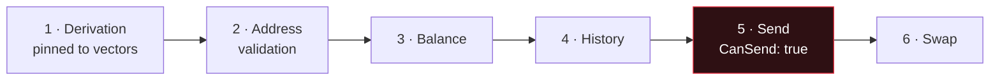

# Adding a chain

End to end, with the gates that exist so a new coin cannot lose somebody's money on its first day.

## The cardinal rule

> **Never show an address you cannot prove, and never offer a send you have not tested end to end.**

A wrong address is not a cosmetic bug — the funds are gone forever, and the user did nothing wrong.
So the order below is not negotiable: an address you can prove, then a balance, then history, then —
last — sending.

`CanSend: false` is a perfectly good state to ship in. "Receive only" is honest. A send path that
"probably works" is not.

## The order



---

## 1 · Derivation, pinned to official vectors

`Core/Derivation/`

Pick the right scheme — secp256k1 BIP32 for Bitcoin-likes, SLIP-0010 ed25519 for Solana/TON,
BIP32-Ed25519 for Cardano, and so on.

**Before writing any UI**, add a test that derives from a known mnemonic and asserts the exact
address, checked against either the chain's published test vectors or the reference wallet everyone
else uses. Not "it looks like an address" — the exact string.

```csharp
[Fact]
public void Derives_the_reference_address_for_the_standard_test_mnemonic()
{
    var address = new HdAddressDeriver()
        .DeriveAt(TestVectors.Abandon, ChainId.YourChain, change: 0, index: 0).Address;

    Assert.Equal("<the address the reference wallet produces>", address);
}
```

If you cannot find a vector, that is the signal to stop, not to guess. Derive the same phrase in the
chain's own reference wallet and use what it shows.

## 2 · Address validation

`Core/Chains/AddressInspector.cs`

Teach it your address format so the wallet can tell a user whether what they pasted is valid *before*
they send. Bech32, Base58Check, CashAddr and EIP-55 helpers already exist.

If you cannot fully verify a format, return `Unverified` — not `Valid`. The wallet says "format
recognised, not deeply verified", which is true, instead of a checkmark that is a lie.

Add it to `ChainCatalog` with the honest capability flags:

```csharp
new ChainInfo(ChainId.YourChain, "SYM", "Your Chain",
    CanSend: false, CanReceive: true, CanSyncBalance: false, HasHistory: false, CanSwap: false,
    …)
```

## 3 · Balance

`Infrastructure/Network/`

Implement the lookup and route it through **`PublicHttp`**. Never `new HttpClient()` — that bypasses
Tor and the kill-switch.

- **UTXO chains**: implement `IUtxoExplorer` (`GetActivityAsync`, `GetUtxosAsync`) and the shared HD
  scanner handles gap-limit discovery for you. Look at `EsploraUtxoExplorer` or `HaskoinUtxoExplorer`.
- **Account chains**: a single balance call is usually enough.

Two rules the scanner already respects and yours must too:

1. **A network error is "unknown", never "empty".** Returning zero on a failed request tells the user
   their coins are gone. Mark the result partial and keep the last known balance.
2. **Do not widen address probing for speed.** Every address you hand an explorer is an address linked
   to that wallet. The scanner's concurrency window is sized to exactly what a sequential walk would
   have queried anyway — keep that property.

Flip `CanSyncBalance: true`.

## 4 · History

`Infrastructure/Network/OnChainHistoryClient.cs`

Map the explorer's response to the shared row shape. Two things matter:

- **Net effect per transaction**, not per input/output — a self-transfer should not look like a spend
  plus a receive.
- **Use the same explorer URL the send path uses**, or the same transaction appears twice in Activity
  under two different links.

Flip `HasHistory: true`.

## 5 · Send — the gate

This is where money moves. Nothing here is "probably fine".

**Build and sign locally.** Use the chain's reference library (NBitcoin, Nethereum, BouncyCastle,
the chain's own SDK). Do not hand-roll signing; do not send a private key anywhere.

**Pin the serialization.** Produce a transaction for a known input set and assert the bytes match what
the reference library produces. TON and Cardano are both pinned this way — that is why the wallet can
claim an address is spendable elsewhere.

**Respect the fee floor.** Use `FeeLevels.Adjust` with your chain's real min/max. Below the relay
minimum the network silently drops the transaction and the user watches it never confirm.

**Zero the key.** Derive, sign, zero. Never store it in a field that outlives the call.

**Two-step review.** The user sees the exact amount, destination and network fee and confirms before
anything is signed. No exceptions, no "quick send".

Then, and only then:

```csharp
CanSend: true
```

**Test it with real money on mainnet, small amounts, before shipping.** Testnet does not prove a
mainnet fee estimator.

## 6 · Swap (optional)

`Infrastructure/Network/ThorchainSwapClient.cs` if the asset is supported there. Re-quote at confirm
time and abort if the rate moved beyond the tolerance — a stale quote is somebody's loss.

## Presentation

Add the human-readable network line so the wallet can print which chain the address is on:

```csharp
// Localization.cs — one entry per language
["net.SYM"] = "Your Chain network",
```

Chain names and standards (BIP84, ERC-20, TRC-20, SPL) stay untranslated on purpose — they are
identifiers a user matches against an exchange's withdrawal screen.

Add a coin badge in `CoinBadge` / `CoinGlyphs`, and check that `net.SYM` exists in **all six**
languages or the parity test will tell you.

## Checklist

- [ ] Derivation pinned to an official vector or the reference wallet
- [ ] Address validation, `Unverified` rather than a false `Valid`
- [ ] Balance through `PublicHttp`; errors are "unknown", not zero
- [ ] No extra address exposure for speed
- [ ] History deduplicates against the send path's explorer
- [ ] Signing via the reference library, serialization pinned
- [ ] Fee clamped to the chain's real band
- [ ] Key zeroed after signing
- [ ] Two-step review before broadcast
- [ ] Mainnet-tested with a small real amount
- [ ] `net.SYM` in all six languages
- [ ] Capability flags in `ChainCatalog` match reality exactly
