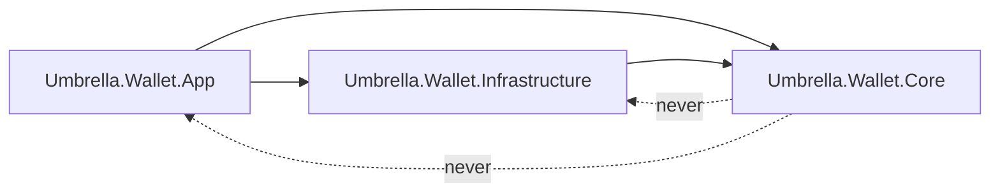
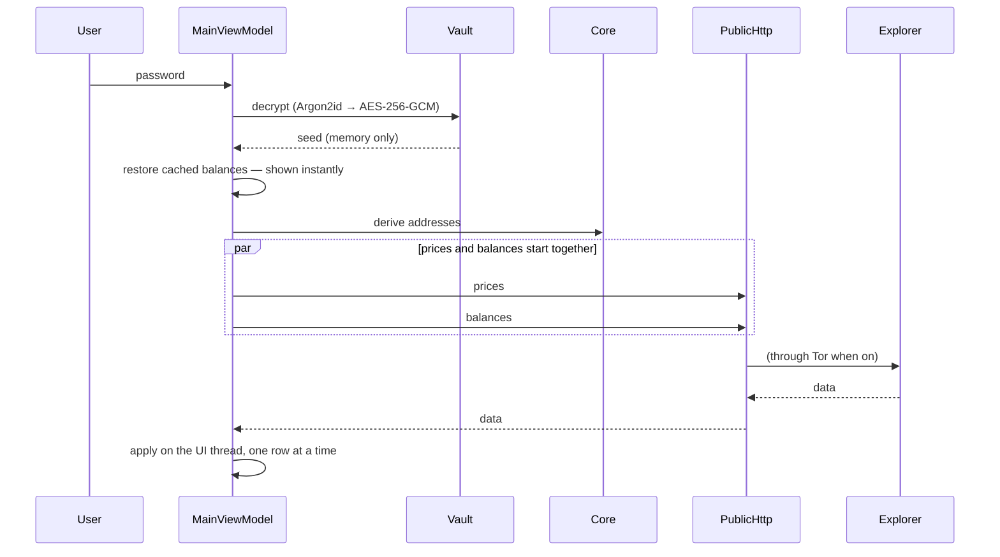

# Architecture

How Umbrella is put together, and — more usefully for anyone changing it — *why* it is put together
this way. Most of these boundaries exist because crossing them is how wallets lose people's money.

## The three projects

```
Umbrella.Wallet.Core             pure logic. No network. No UI. No file system.
Umbrella.Wallet.Infrastructure   everything that does I/O.
Umbrella.Wallet.App              Avalonia UI and view models.
```

The dependency arrows only ever point one way:



### Why `Core` may not touch the network

Every piece of logic where a mistake costs money lives in `Core`: key derivation, UTXO selection, fee
arithmetic, amount parsing, address validation, privacy analysis. Because none of it can reach the
network, all of it is testable offline, deterministically, against published vectors.

That is the whole point. "We tested the send path" means nothing if the test needed a live explorer
and a funded wallet. It means a great deal if it runs in 20 ms on a laptop with the Wi-Fi off.

If you find yourself wanting an `HttpClient` in `Core`, the design has drifted. Pass the data in, or
define an interface in `Core` and implement it in `Infrastructure` — that is what `IUtxoExplorer` is.

## Where the money logic lives

| Concern | Type | Notes |
|---|---|---|
| Seed → keys | `Derivation/` | BIP32 (Bitcoin family), SLIP-0010 ed25519 (SOL, TON), BIP32-Ed25519 (ADA), Monero's own scheme |
| Address discovery | `Utxo/UtxoAccountScanner` | gap-limit walk, probes in bounded concurrent windows |
| Spend planning | `Utxo/HdUtxoSpender` | input selection, change to a fresh internal address |
| Fee tiers | `Utxo/FeeLevels` | Economy / Standard / Priority, clamped per chain |
| Amount parsing | `Amounts/AmountInput` | **every** user-typed amount goes through this |
| Address checks | `Chains/AddressInspector` | EIP-55, Base58Check, Bech32, CashAddr |
| Privacy analysis | `Safety/PrivacyScoreInspector` | wallet-wide score |
| Spam detection | `Safety/SpamTokenInspector` | unsolicited airdrop tokens |

### `AmountInput` is not optional

`decimal.TryParse("0,5", NumberStyles.Number, CultureInfo.InvariantCulture)` returns **5**, not 0.5.
A user in a comma-decimal locale typing "0,5 BTC" would send ten times what they meant.

Every amount a human types goes through `AmountInput.TryParsePositive`. There is a test for this and
it is not decoration. If you add a field that accepts an amount, use it.

## Where I/O lives

```
Infrastructure/
  Network/
    PublicHttp                  the ONE http client. Tor-aware.
    EsploraUtxoExplorer         BTC / LTC
    HaskoinUtxoExplorer         BCH
    BlockCypherUtxoExplorer     DOGE
    PublicChainClients          balances, prices, candles
    OnChainHistoryClient        transaction history
    *TransactionSender          per-chain broadcast
    EmbeddedTorService          the bundled Tor process
    MoneroRpcService            the local monero-wallet-rpc
  EncryptedFileSeedVault        Argon2id → AES-256-GCM
  DeveloperFeeConfig            the platform fee (currently zero)
```

### One HTTP client, on purpose

Everything that leaves the machine goes through `PublicHttp`. That is what makes "route it all through
Tor" a property of the system rather than a promise repeated at each call site — and it is what makes
the kill-switch possible: one place can decide that a request which cannot go through Tor does not go
at all.

A new `new HttpClient()` anywhere else is a privacy bug, not a style issue.

### Monero is different, and that is unavoidable

Monero hides amounts on-chain, so no explorer can report a balance. The wallet therefore ships and
runs the real `monero-wallet-rpc` as a child process, bound to loopback only, and asks it. This is why
the Monero balance takes longer to appear than the others — it is a wallet syncing, not an API call.

## The UI layer

`MainViewModel` is one class split across several files by feature (`MainViewModel.Send.cs`,
`.Activity.cs`, `.Chart.cs`, …). They are `partial` — same type, same behaviour, just a file each so
no single file is 6000 lines.

Three things in the App project are worth knowing about before you edit anything:

| File | Rule |
|---|---|
| `Localization.cs` | Every user-facing string. Six languages, kept at parity by a test. |
| `Theming.cs` | 19 palettes. A contrast test fails the build if a theme becomes unreadable. |
| `GuideContent.cs` | The in-app guide, English + Ukrainian, kept at parity by a test. |

XAML uses `x:CompileBindings`, so a typo in a binding is a **build error**, not a blank label at
runtime. This is deliberate: it means "it builds" is a much stronger statement than usual.

## Data flow: unlocking and showing a balance



Two details that are easy to undo by accident:

1. **Cached balances are painted before the network is touched**, so unlocking shows your real numbers
   immediately instead of flashing `$0`.
2. **Prices and balances are started together.** They are independent; only the display joins them. If
   you `await` one before starting the other, you have just doubled the time to first balance.

## Concurrency rules

Network work runs in parallel. UI state does not.

- Fetching may fan out — address probes, per-chain balances, watch-only addresses all run concurrently.
- **Mutating `Accounts` happens one at a time, on the UI thread.** Every parallel section collects
  results first and applies them in a serial loop afterwards.

The address scanner is the sharpest example: it probes addresses in concurrent windows, but the window
is sized to exactly what a strictly sequential walk would have queried anyway. Speed must not cost
privacy — a wider window would reveal more of your addresses to the explorer.

## Things that will fail the build

These are not lint rules; they are tests that exist because each one was a real bug.

- A hardcoded user-facing string in a view or in the send/backup/status paths.
- A language table missing a key another language has.
- A theme whose text falls below WCAG AA contrast.
- A binding typo in XAML.
- Two themes that resolve to the same palette.

## See also

- [building.md](building.md) — build, run, test, package
- [security-model.md](security-model.md) — threat model and crypto choices
- [adding-a-chain.md](adding-a-chain.md) — the safety gates a new coin must pass
- [04-desktop.md](04-desktop.md) — older, more granular desktop notes

---

📖 Back to [Documentation Index](INDEX.md)

