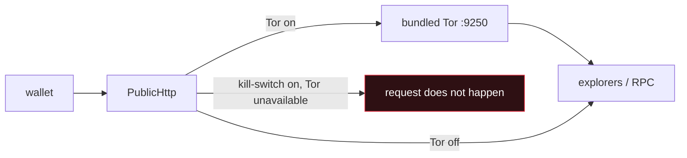

# Security model

What Umbrella protects, how, and — the part most wallets skip — what it explicitly does **not**
protect you from.

If you only read one section, read [What this does not protect you from](#what-this-does-not-protect-you-from).

## Threat model

Umbrella is built for someone who assumes the network is hostile and the service is not on their side.

| Adversary | Covered? | How |
|---|---|---|
| A service that wants your identity | ✅ | There is no service. No account, email, phone, or KYC. |
| A block explorer profiling you by IP | ✅ | Bundled Tor + a kill-switch that fails closed. |
| Someone who steals the vault file | ✅ | Argon2id (m=64 MiB) → AES-256-GCM. Brute force is expensive by design. |
| Someone who steals the whole laptop, locked | ✅ | Auto-lock on idle and on minimise; the seed is not at rest in memory. |
| Screen recording / screenshots of your seed | ✅ | Seed and key screens set `WDA_EXCLUDEFROMCAPTURE`. |
| Chain analysis linking your coins | ⚠️ Partly | Coin control, fresh change addresses, Privacy Radar warns you. It informs; it cannot undo a public ledger. |
| Address-poisoning / lookalike addresses | ⚠️ Partly | Poisoning defence, EIP-55 checksum warnings, first-time-recipient notice. |
| Malware already running as you | ❌ | See below. |
| Someone who has your 24 words | ❌ | Those *are* the wallet. |
| $5 wrench | ❌ | A duress password is on the roadmap. It is not shipped. |

## Cryptography

| Layer | Choice | Why |
|---|---|---|
| Entropy | OS CSPRNG, 256-bit | `RandomNumberGenerator`, never `System.Random` |
| Seed | BIP39, 24 words | interoperable with every major wallet |
| KDF | Argon2id, m=64 MiB, t=4, p=2 | memory-hard: GPU/ASIC brute force stops being cheap |
| Vault cipher | AES-256-GCM | authenticated — a tampered vault fails to open rather than decrypting to garbage |
| Associated data | versioned | a vault from an older format cannot be silently reinterpreted |
| Derivation | BIP32 / BIP44 / BIP84, SLIP-0010 ed25519, BIP32-Ed25519, Monero's scheme | per-chain standard, each pinned to official vectors |
| Signing | NBitcoin, Nethereum, BouncyCastle ed25519 | the chains' own reference implementations — no hand-rolled curve maths |

### Key handling

Private keys are derived when needed, used, and zeroed immediately. They are never written to disk,
never logged, and never placed in a field that outlives the operation.

The one thing that lives longer is the decrypted seed while the wallet is unlocked — it has to, to
derive an address. Auto-lock and `Ctrl+L` exist to bound that window.

**Never log a seed, a private key, or a raw signed transaction.** There is no debug flag that turns
this on. If you are adding logging to the send path, log the *decision*, not the material.

## Network

Everything that leaves the machine goes through one Tor-aware HTTP client.

- The bundled Tor runs on **port 9250**, deliberately not 9050, so a Tor Browser you already have open
  is untouched.
- The **kill-switch** makes failure closed. Without it, "Tor is having a bad day" silently becomes
  "your IP went to the explorer".
- Turn Tor on **before unlocking** if you don't want your addresses queried over clearnet even once.

### What leaves, and what never does

| Never leaves the device | Leaves (to public explorers / RPCs) |
|---|---|
| Seed phrase | The addresses you look up |
| Private keys | Transactions you broadcast |
| Vault password | Price lookups |
| Private transaction notes (encrypted in the vault) | |

No telemetry. No analytics. No crash reporting. No "anonymous usage statistics". Nothing is phoned
home, because there is nowhere to phone.

### NFTs, deliberately text-only

NFTs are listed by name and count. Their images are **not** fetched, because an image URL is usually
an IPFS gateway or a third-party CDN that would learn your IP and which NFT you hold. Nicer-looking
grid, worse privacy. We chose privacy, and this is the kind of trade-off that should be stated rather
than assumed.

## Monero specifics

Monero runs the real `monero-wallet-rpc` as a local child process bound to **loopback only**. It is
never exposed on a network interface. Balance computation happens on your machine because no explorer
can do it for you — which is exactly why Monero is private, and why its balance is slower to appear
than the others.

The Monero **spend key** is as sensitive as your seed phrase. Settings → Monero → Reveal keys is
capture-protected for the same reason the seed screen is.

### The remote node

A Monero wallet cannot read the chain on its own — it asks a node, and unless you run one, that node
is somebody else's machine. This is the most consequential setting on Monero and the easiest one for
a wallet to make silently. Umbrella did exactly that until this was added; now **Settings → Privacy →
Monero node** names the machine being asked, offers alternatives, and takes a custom `host:port`
including a `.onion`.

What the node observes: the connecting IP (an exit node when Tor is on), that it belongs to a Monero
wallet, roughly which block range it requested, when it is online, and which connection a submitted
transaction entered the network through.

What it does not observe: the keys, the balance, the addresses, or the amounts. Those stay local, and
Monero encrypts amounts on the chain itself.

Two refusals are enforced rather than warned about, both fail-closed:

- A `.onion` node with Tor off is **not** attempted, and is **not** silently swapped for a clearnet
  one. Substituting a different operator behind the user's back is the behaviour this feature exists
  to end.
- Any node while the Tor-only kill-switch is armed and Tor is down is refused outright, because
  connecting would hand out the exact IP the kill-switch exists to hide.

`MoneroNodeTests` pins both refusals, along with the address parser — a mistyped node is not merely a
wallet that never syncs, it is a stranger answering for the chain.

## Who the wallet talks to

The keys stay local. That is true, and every wallet says it. The part usually left unsaid is that a
wallet still has to **ask somebody what is on the chain** — and on a transparent chain, asking means
handing over the very address you were trying to keep to yourself. Whoever answers *"what is the
balance of bc1q…"* now knows that address belongs to a wallet, and can tie every address asked about
in one session to one person.

**Tor hides the IP. It does not un-send the address.**

So Settings → Privacy carries the full list: every server, who runs it, why it is contacted, and what
it learns. Entries are marked by whether they are called automatically, only when you do a specific
thing, only if you connect an account yourself, or never at all (a block explorer the wallet links to
but never calls).

`NetworkCounterpartyTests` scans the source for hostnames in URLs and fails the build if one is not
declared in `NetworkCounterpartyCatalog` — and fails the other way too, if the catalog lists a host
the code no longer uses. A transparency page that can silently fall behind the code is worse than
none, because it reassures without being true, and the person reading it is reading it because they
need the truth.

The catalog's own claims are checked for coherence as well: a link-only host may not be listed as
learning anything, anything the wallet actually calls must admit to learning at least the IP (there
is no such thing as a request that reveals nothing), a price feed may not be marked as seeing
addresses, and only an opt-in exchange connection may be marked as holding credentials.

## What this does not protect you from

Being direct about this is the point.

**Malware running as your user.** If something is already executing on your machine with your
privileges, it can read your keystrokes, your clipboard, and the wallet's memory while it is unlocked.
No desktop wallet solves this. A hardware wallet is the answer, and Umbrella does not yet support one.

**Losing your 24 words.** If you lose both the words and the vault password, the funds are gone.
Nobody can recover them. That is the same property that means nobody can freeze them.

**A transparent blockchain.** Tor hides your IP from an explorer. It does not make Bitcoin private.
BTC, ETH, LTC, DOGE, BCH, TRON and Zcash-transparent are **public ledgers** — anyone can read them
forever. Privacy Radar tells you what a given send reveals; it cannot make a public ledger private.
If you need real on-chain privacy, use Monero.

**Coercion.** If somebody forces you to open the wallet, it opens. A duress password that opens a
decoy wallet is on the roadmap and is not shipped — this page will say so until it is.

**Zcash is transparent-only here.** Shielded addresses are not implemented. It is listed that way in
the wallet rather than implying privacy that is not there.

**No external audit yet.** 526 offline tests, public CI, CodeQL and secret scanning are real evidence
but they are not an audit. An audit is on the roadmap. Until it happens, this page will not claim one.

## Reporting a vulnerability

Please report privately:
**[github.com/kiurakku/UmbrellaWallet/security/advisories/new](https://github.com/kiurakku/UmbrellaWallet/security/advisories/new)**

Do not open a public issue for anything that could put funds at risk. See [SECURITY.md](../SECURITY.md)
for scope, expected response time, and what counts as in-scope.

## For reviewers: where to look first

If you are auditing this and have limited time, these are the paths where a bug costs money:

| Priority | Path |
|---|---|
| 1 | `Core/Utxo/HdUtxoSpender.cs` — input selection and change |
| 2 | `Core/Derivation/` — every address the user is told to use |
| 3 | `Infrastructure/EncryptedFileSeedVault.cs` — the vault format |
| 4 | `Core/Amounts/AmountInput.cs` — the "0,5 is not 5" boundary |
| 5 | `Infrastructure/Network/PublicHttp.cs` — the single network chokepoint and kill-switch |
| 6 | `App/ViewModels/MainViewModel.Send.cs` — review → confirm → broadcast |
